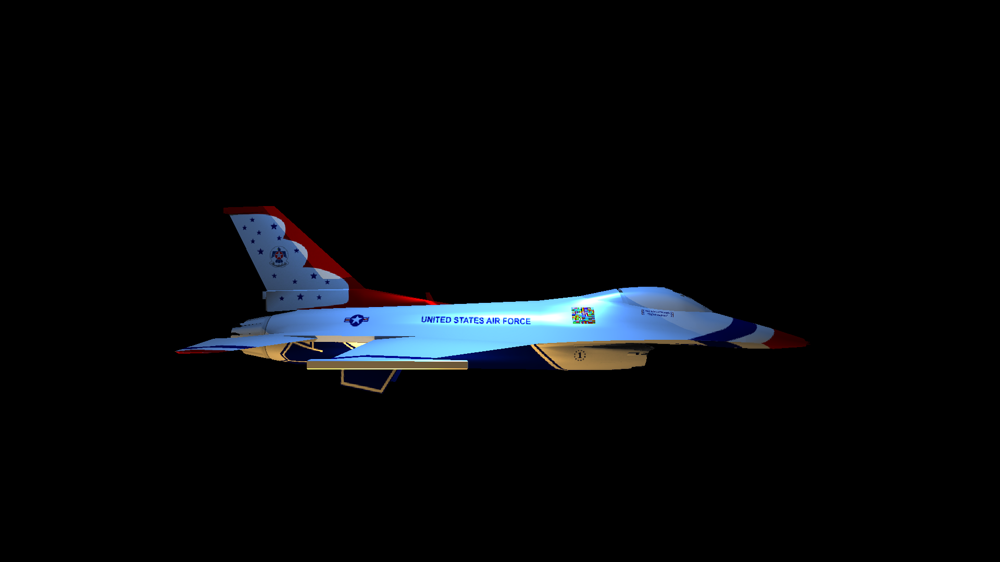
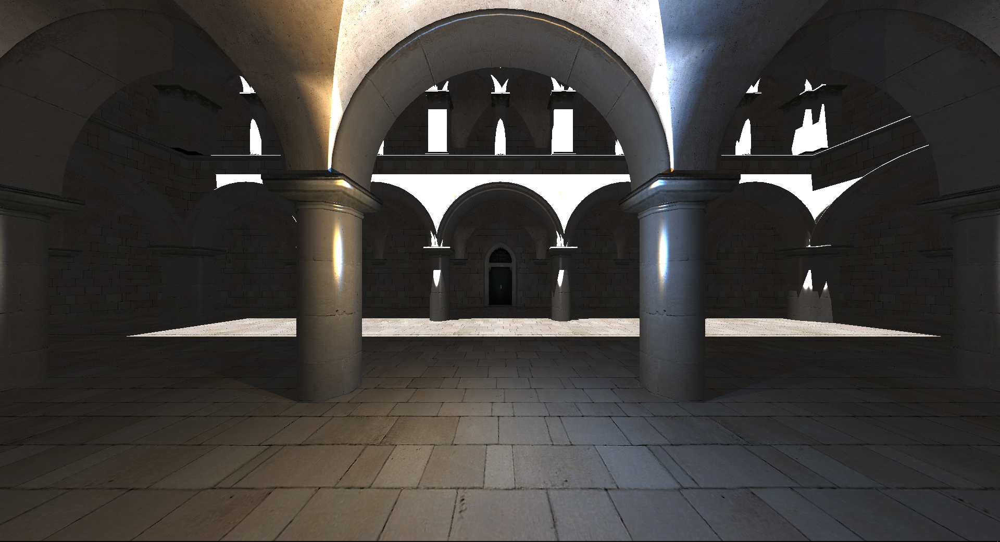
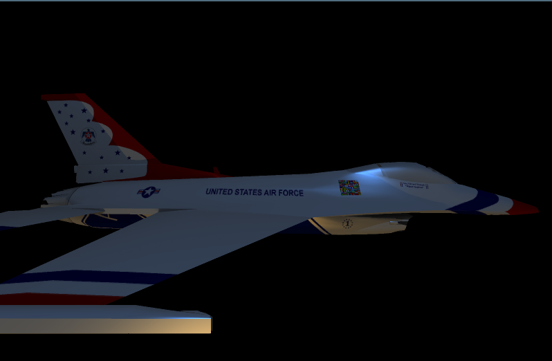

# Raytracer in c++ using GLM only
Additionally SDL for display window, Assimp for model loading, stb_image.h for texture image loading.
So far, there is no cmake for this project. There is a visual studio project file though.

**Dispersion examples**

  
 

Texturing wip

 

(WIP tracing trough alpha)

Older

Multisampling

